# Function-approximation
Scripts with approximation methods

## 1. Wyznaczanie funkcji aproksymującej przy wykorzystaniu aproksymacji średniokwardratowej ciągłej i ortogonalizacji Grama-Schmidta

### Poszukiwany jest wielomian ugólniony:
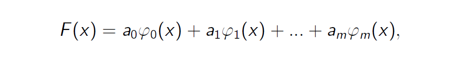

### który minimalizuje odległość: 
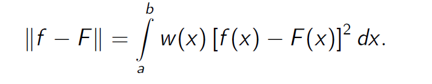

### Przy ustalonej postaci funkcji bazowych oznacza to poszukiwanie współczynników a0, a1, ..., am wielomianu, które minimalizują wartość wyrażenia:
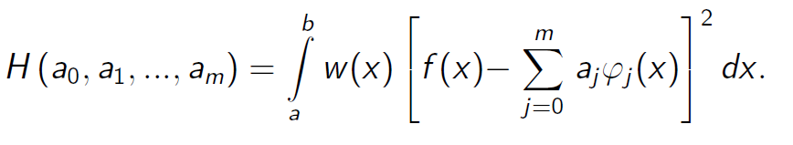

### Powstaje układ m+1 równań:
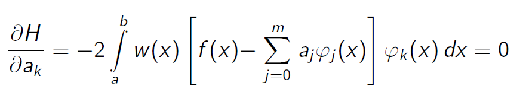

### Przy założeniu, że funkcje bazowe są jednomianami, a funkcja wagowa w(x) ≡ 1, powstaje układ równań:
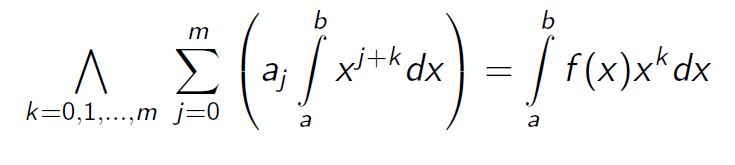

### Po przyjęciu poniższych oznaczeń przyjumuje on następującą postać:
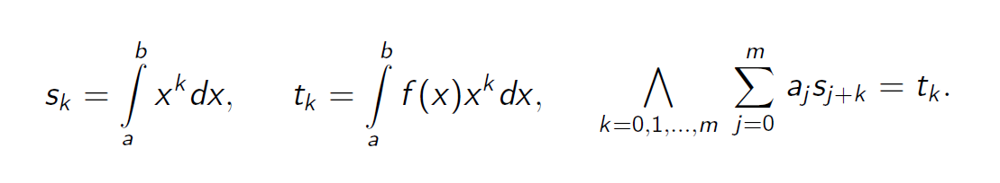

### Ortogonalizacja Grama-Schmidta

### Współczynniki w aproksymacji z wykorzystaniem G-S przyjmują wartości:
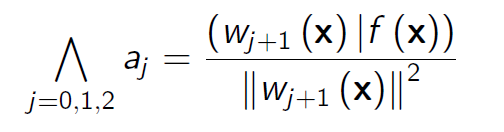

## 2. Wyznaczanie funkcji aproksymującej przy wykorzystaniu aproksymacji średniokwardratowej dyskretnej i ortogonalizacji Grama-Schmidta

### Poszukiwany jest wielomian ugólniony:

### który minimalizuje odległość: 
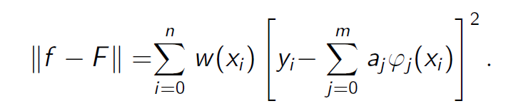

### Przy ustalonej postaci funkcji bazowych oznacza to poszukiwanie współczynników a0, a1, ..., am wielomianu, które minimalizują wartość wyrażenia:
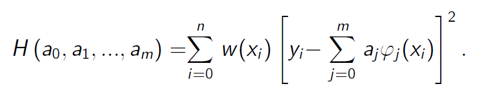

### Powstaje układ m+1 równań:
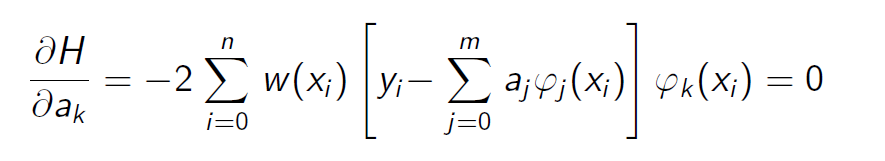

### Przy założeniu, że funkcje bazowe są jednomianami, a funkcja wagowa w(x) ≡ 1, powstaje układ równań:
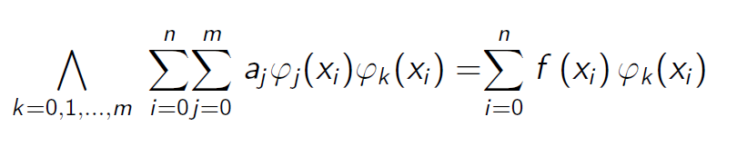

### Po przyjęciu poniższych oznaczeń przyjumuje on następującą postać:
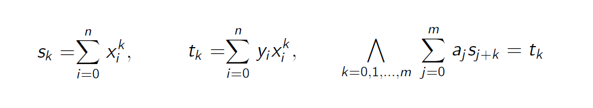

### Ortogonalizacja Grama-Schmidta

### Współczynniki w aproksymacji z wykorzystaniem G-S przyjmują wartości:

## 3. Wyznaczanie funkcji aproksymującej przy wykorzystaniu szergów Taylora i Maclaurina